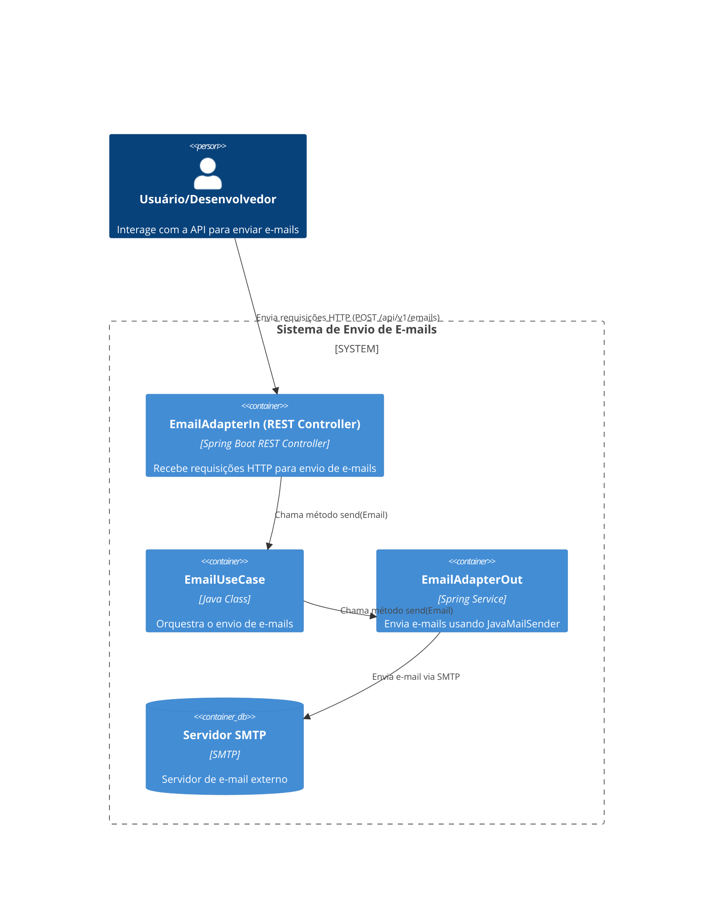

# ms-email-service

## Descrição do Projeto

O ms-email-service é um microserviço responsável por gerenciar o envio de e-mails.

## Tecnologias Utilizadas

* Java 21
* Maven 3.6.3
* Spring Boot
* Spring Data Email
* Lombok

## Requisitos

* Java 21
* Maven 3.6.3 ou superior

## Configuração do Ambiente

### Clonando o Repositório

```bash
  git clone git@github.com:kenneth-de-oliveira/ms-email-service.git
```

### Instalando as Dependências

```bash
  mvn clean install
```

## Configuração do Banco de Dados

### Ambiente de Desenvolvimento

O projeto está configurado para usar o application-dev.yml para o ambiente de desenvolvimento. Por padrão é configurado uma instância para o chamar o Mail Trap.  
Você pode usar variáveis de ambiente para configurar o properties:
* MAIL_HOST: Host do servidor de e-mail (padrão: smtp.mailtrap.io)
* MAIL_PORT: Porta do servidor de e-mail (padrão: 2525)
* MAIL_USERNAME: Nome de usuário do servidor de e-mail (padrão: seu_usuario)
* MAIL_PASSWORD: Senha do servidor de e-mail (padrão: sua_senha

### Ambiente de Produção

O projeto está configurado para usar o application-prod.yml para o ambiente de produção.  
Você pode usar variáveis de ambiente para configurar o properties:
* MAIL_HOST: Host do servidor de e-mail (padrão: smtp.seuservidor.com)
* MAIL_PORT: Porta do servidor de e-mail (padrão: 587)
* MAIL_USERNAME: Nome de usuário do servidor de e-mail (padrão: seu_usuario)
* MAIL_PASSWORD: Senha do servidor de e-mail (padrão: sua_senha)

## Executando a Aplicação

Para executar a aplicação, use o seguinte comando:

```bash
  mvn spring-boot:run
```

## Diagrama do Sistema


## Exemplo de Requisição

```bash
  curl -X POST http://localhost:8080/api/v1/emails \
  -H "Content-Type: application/json" \
  -d '{
        "to": "kennetholiveira2015@gmail.com",
        "subject": "Teste de Envio de E-mail",
        "text": "Este é um teste de envio de e-mail usando o ms-email-service."
      }'
```

## Logs Arquivados

O projeto está configurado para arquivar logs diariamente. Os logs arquivados são armazenados no diretório
`./logs/archived/` com o padrão de nome `spring-boot-logger-YYYY-MM-DD.log`.

### Configuração do Logback

A configuração do Logback para arquivamento de logs está definida no arquivo `src/main/resources/logback-spring.xml`.
Abaixo está um exemplo de configuração:

```xml

<configuration>
    <appender name="RollingFile" class="ch.qos.logback.core.rolling.RollingFileAppender">
        <file>./logs/spring-boot-logger.log</file>
        <rollingPolicy class="ch.qos.logback.core.rolling.TimeBasedRollingPolicy">
            <fileNamePattern>./logs/archived/spring-boot-logger-%d{yyyy-MM-dd}.log</fileNamePattern>
        </rollingPolicy>
        <encoder>
            <pattern>%d{yyyy-MM-dd HH:mm:ss.SSS} [%thread] %-5level %logger{36} - %msg%n</pattern>
        </encoder>
    </appender>

    <root level="INFO">
        <appender-ref ref="RollingFile"/>
        <appender-ref ref="Console"/>
    </root>
</configuration>
```
